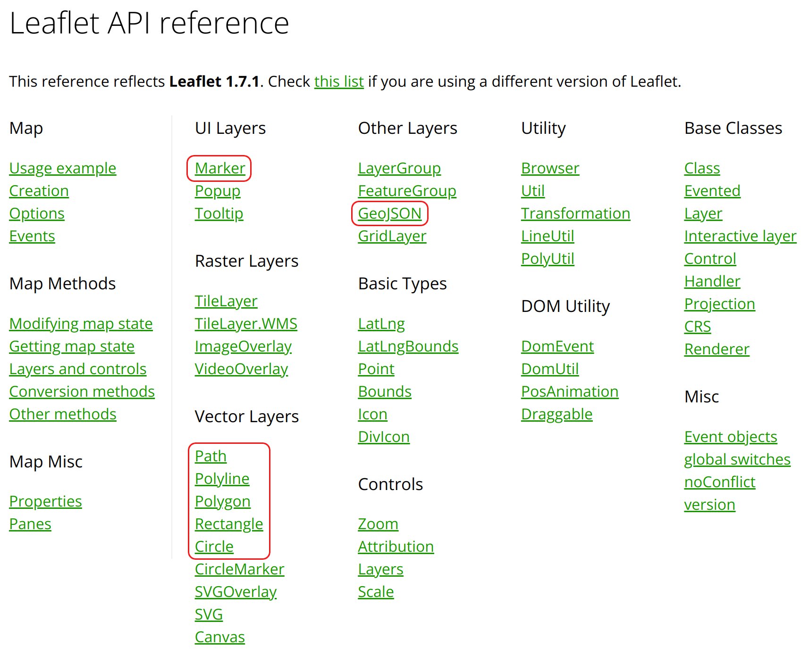

# Intro to GeoJSON

So far there's a couple ways we've worked with geospatial data in our maps:

1. Week 2: maps of favorite places to eat and play
2. Weeks 3 & 4: picked out lat/lng pairs from lists of schools

So far, we've only worked with point data. To add these points to the map, we used a feature of the Leaflet library called a "marker":

```js
// First we created a marker object...
const myMarker = L.marker([39.6, -75.1]);

// Then we added tooltips or popups...
myMarker.bindTooltip(...);
myMarker.bindPopup(...);

// And we added the marker to a map or a layer group...
myMarker.addTo(myMap);
```

Except we usually did it in shorthand as one statement:

```js
L.marker([39.95, -75.16]).bindTooltip(...).addTo(myMap);
```

## Beyond Points

However, point data is not the only data that we can add to our maps. In the image below I've highlighted a few other types of shapes we can add with Leaflet. Some of these (like `Circle` and `Rectangle`) are very simple, while others (`Polyline`, `Polygon`) can represent complex shapes.



Like we have done with `Marker`, we can create these other vector layers manually by calling the appropriate functions (e.g., `L.polyline` or `L.polygon`), but developers will more often use GeoJSON to represent complex shapes.

## Why GeoJSON

* It's a standard
* It's human-readable
* It's JSON, and inherits JSON's benefits...
  * lots of people are familiar with JSON
  * most programming languages can handle JSON by default
* **In JavaScript, working with JSON is seamless**

## What's GeoJSON

Let's go through [the GeoJSON chapter](http://132.72.155.230:3838/js/geojson-1.html#what-is-geojson) of _Introduction to Web Mapping_.
